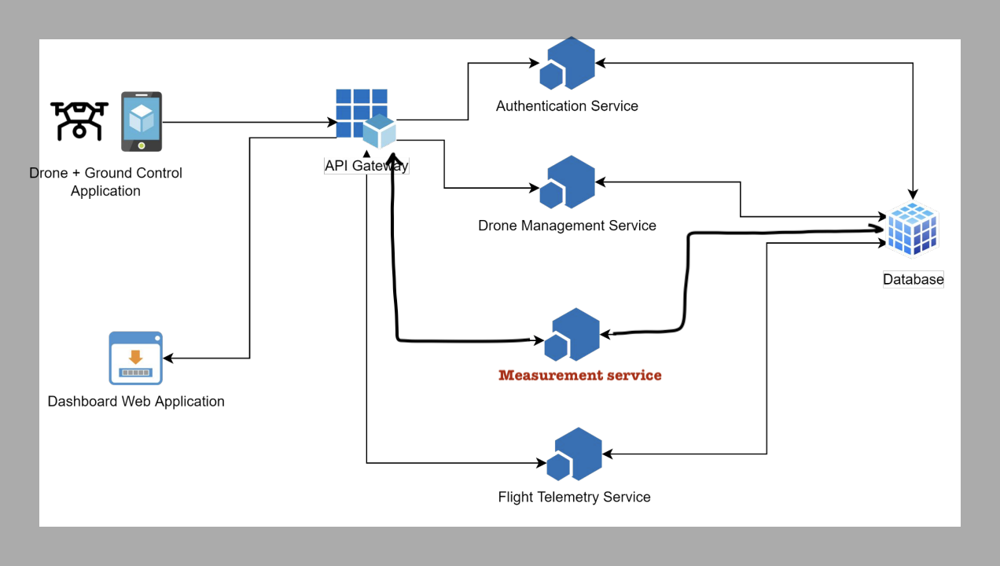

## Description

This is measurement-service, that make with NestJs, MongoDB and Docker

## For developer

Start MongoDB

```bash
$ docker compose -f dev-docker-compose.yml up
```

Careate .env file with content below.

"MyDatabase" is Database name do not change it.

```bash
$ MONGODB=mongodb://localhost:27017/MyDatabase
```

Install dependencies

```bash
$ npm install
```

Start

```bash
$ npm run start:dev
```

## Running the app (Production with docker compose)

```bash
$ docker compose up
```

## Build docker image

```bash
$ docker build -t myapp .
```

## API Document

[API Document](https://documenter.getpostman.com/view/12777988/2s8YswQBiF)

## Assignment #2 Architecture Design


